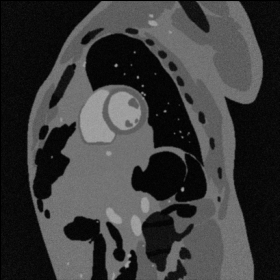
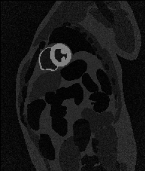
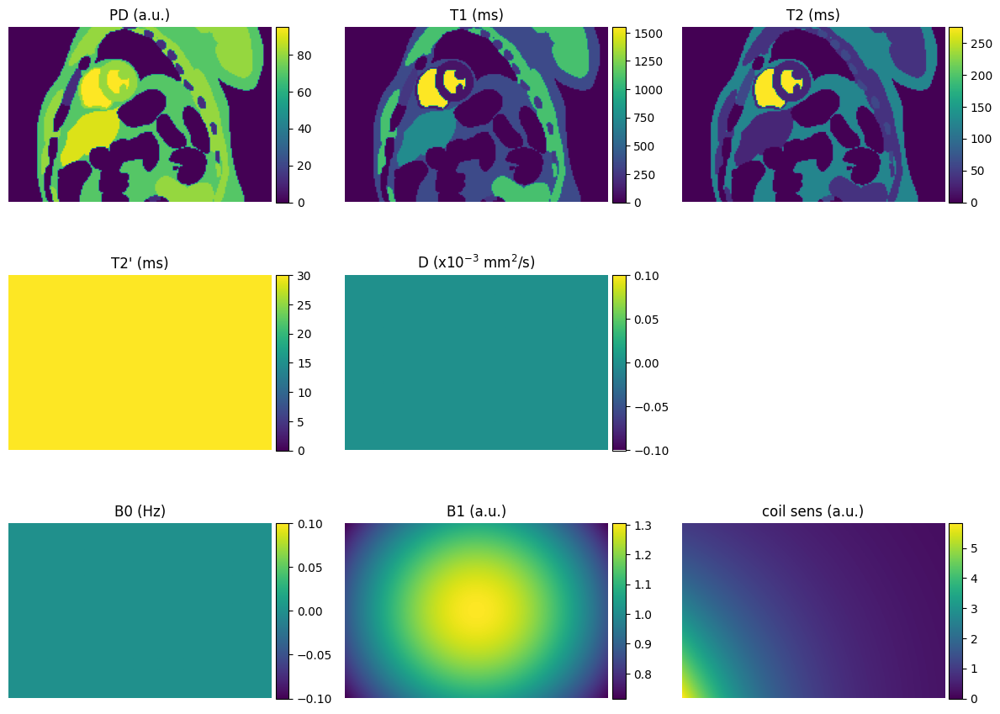
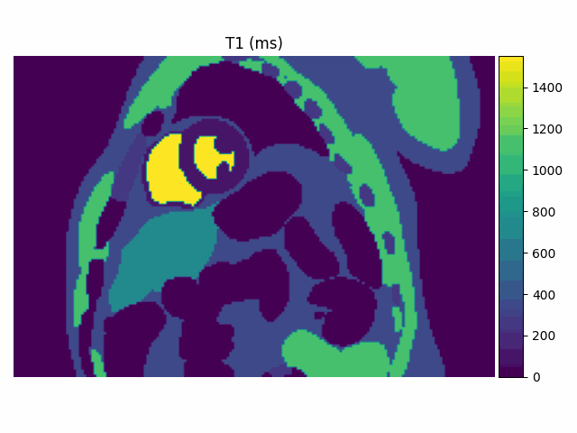
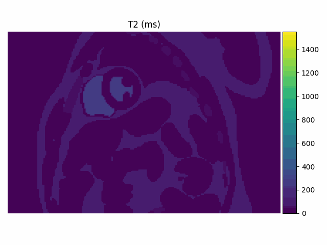

# pyMRzeroXCAT
Python version of the MRXCAT MATLAB repository.

# Table of Contents

- [Install](#install)
- [Run CINE and PERF models](#run-cine-and-perf-models)
- [Build MRzero Phantom](#build-mrzero-phantom)
- [Example in Jupyter Notebook](#example-in-jupyter-notebook)
- [References](#references)

## Install

1. Download the repository:
   ```bash
   # clone project
   git clone https://github.com/CyprienBouton/pymrzeroxcat
   cd pyMRzeroXCAT
   ```
2. Create a virtual environment (Conda is strongly recommended):
   ```bash
   # create conda environment
   conda create -n mrxcat python=3.10
   conda activate mrxcat
   ```
4. Install the project in editable mode and its dependencies:
   ```bash
   pip install .
   ```

Several new commands will be added to the virtual environment once the installation is completed.
These commands all start with `mrxcat_`.

## Run CINE and PERF models 
	
1. Ask cine and perfusion dataset .zip file from https://www.biomed.ee.ethz.ch/mrxcat,
	After downloading, extract the contents and add them to this repository.

2. Adapt the MRXCAT parameters in [MRXCAT_CMR_CINE/cine_par.py](pymrzeroxcat/MRXCAT_CMR_CINE/cine_par.py)
 and [MRXCAT_CMR_PERF/perf_par.py](pymrzeroxcat/MRXCAT_CMR_PERF/perf_par.py) to your needs. 
	For a first try, go with the predefined parameters.

3. Start cine or perfusion MRXCAT by typing
	`mrxcat_cine` or `mrxcat_perf` into the command line.
    
4. 	Select the first XCAT .bin file from the cine and perfusion datasets
	(cine_act_1.bin for cine, perfusion_act_1.bin for perfusion). 
	Once the simulation is done, you get the following files:
	- *.cpx		MRXCAT phantom data
	- *.msk		XCAT mask data
	- *.sen		MRXCAT coil sensitivity maps
	- *.noi		MRXCAT noise only
	- *_par.mat	MRXCAT parameters
    
5. To display the produced phantom, run `mrxcat_visualize` and select
	the *.cpx file in the file selection dialog.

 <br>


## Build MRzero Phantom

1. Ask cine and perfusion dataset .zip file from https://www.biomed.ee.ethz.ch/mrxcat,
	After downloading, extract the contents and add them to this repository.

2. Adapt the MRXCAT tissues parameters in [pymrzeroxcat/tissues.json](pymrzeroxcat/tissues.json) to your needs. 
	For a first try, go with the predefined parameters.

3. Create a MRzero [Phantom](https://mrzero-core.readthedocs.io/en/latest/api/phantom.html#voxel-grid-phantom) 
with the command `mrxcat_build_static`.

4. Select the first XCAT .bin file from the lge dataset.
   Once the simulation is done, you get the following files:
   - *.npz MRzero parameter file to initialize a **VoxelGridPhantom**



<p align="center">
  
  
</p>

## Example in Jupyter Notebook
A basic example of a Flash 2D sequence simulation using the MRXCAT phantom in MRzero framework can be found [here](examples/simulate_MRXCAT_Flash2D.ipynb).

## References
If you use this code for research, please cite the following paper 
[Wissmann L, Santelli C, Segars WP, Kozerke S. MRXCAT: Realistic Numerical Phantoms for Cardiovascular Magnetic Resonance. J Cardiovasc Magn Reson 2014;16:63.](https://pubmed.ncbi.nlm.nih.gov/25204441/)